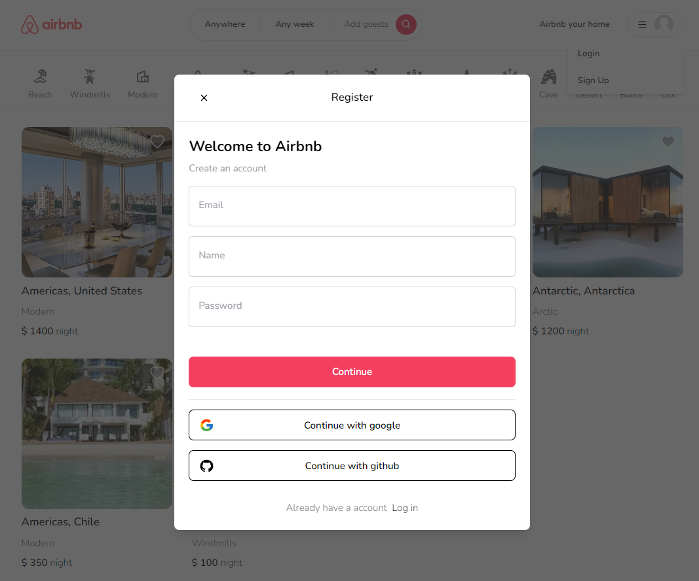
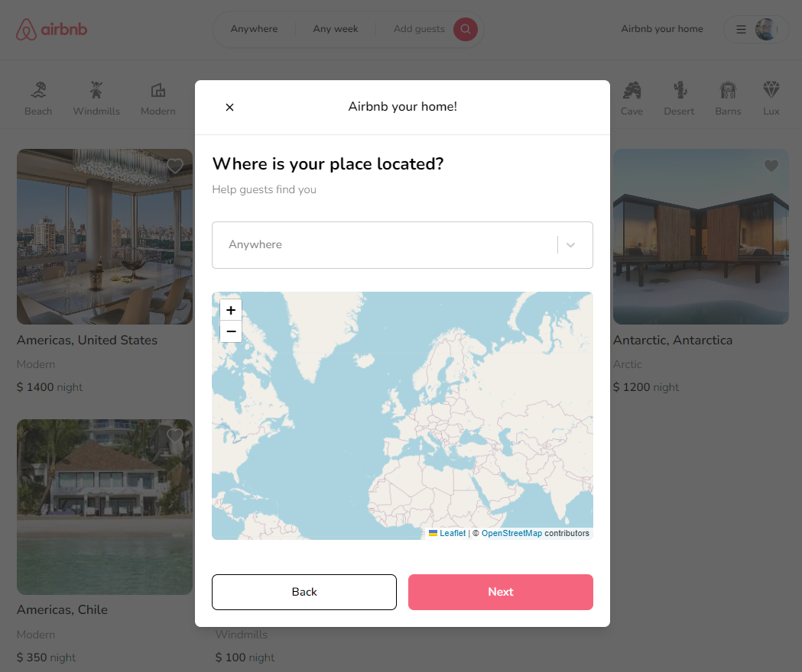

# Airbnb Clone with Next.js 13 App Router: React, Tailwind, Prisma, MongoDB, NextAuth 2023

Thanks to the instructor Antonio!!

https://www.youtube.com/watch?v=c_-b_isI4vg





Link to the app deployed with Vercel 👍:
https://nextjs-tutorial-h66fqrk6s-scastilloh.vercel.app/

- React
- NextJS 13
- NextAuth
- Tailwind
- Prisma
- MongoDB
- react-icons
- zustand
- axios
- react-hook-form
- react-hot-toast
- bcrypt
- query-string
- world-countries
- react-select
- react-leaflet
- next-cloudinary
- date-fns
- react-date-range
- react-spinners

```
npm run dev
```

```
npm prisma init
```
